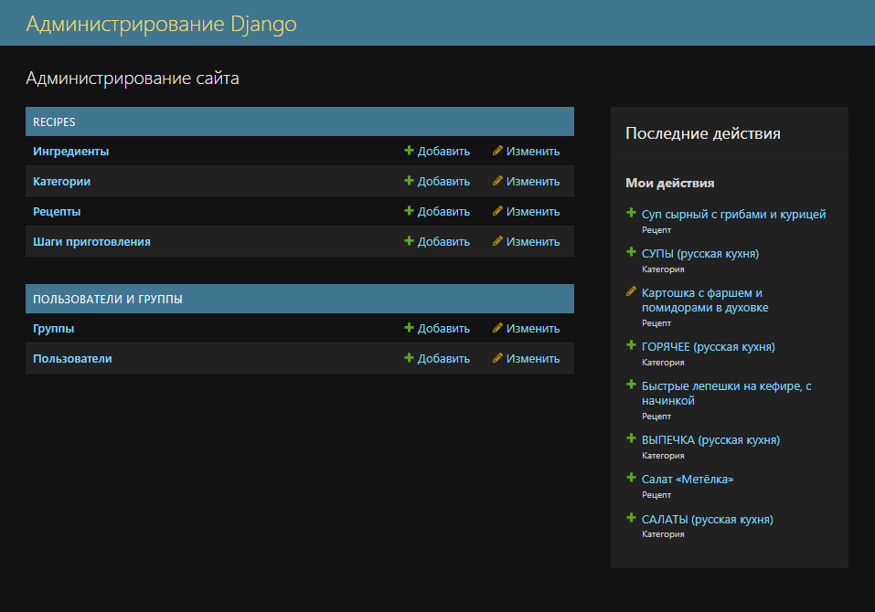
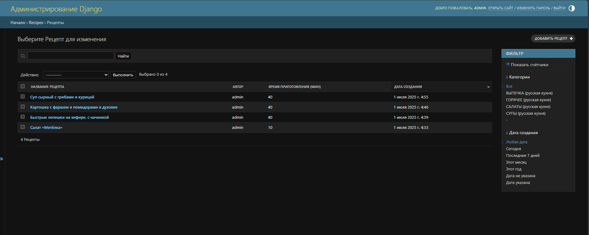
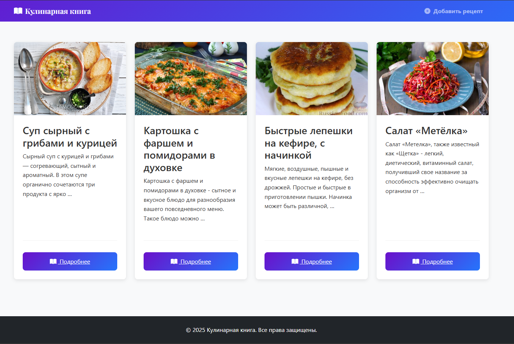

# Итоговая аттестация. Технологическая специализация: Веб-разработка на Python

## Цель задания: _повторить и отработать на практике материал, изученный в ходе программы._

## Проект включает в себя **обязательное задание** и **дополнительные задания**.

- Обязательное задание необходимо выполнить для получения диплома.
  За него ставится оценка.
- Дополнительные задание можно выполнить для портфолио и также
  сдать и получить обратную связь. Его выполнение полезно, но не
  влияет на оценку.

## Инструменты, которые обязательно нужно использовать для **обязательного задания**: _Python, Фреймворк Django_

# Обязательное задание

## _Проект “Сайт рецептов” на Django_

### **Краткое описание задания**

Используя фреймворк Django создайте сайт, на котором пользователи смогут
добавлять свои рецепты блюд и просматривать рецепты других пользователей.
Готовый проект необходимо сдать в виде ссылки на рабочий сайт в сети интернет и
репозитория с исходным кодом проекта.

### Модели
Для работы с пользователями используйте встроенного в Django User`a.

Подготовьте нижеперечисленные модели:

1. Рецепты:

    * Название
    * Описание
    * Шаги приготовления
    * Время приготовления
    * Изображение
    * Автор
    * *другие поля на ваш выбор, например ингредиенты и т.п.
2. *Категории рецептов
    * Название
    * *другие поля на ваш выбор
3. *Связующая таблица для связи Рецептов и Категории
    * *обязательные для связи поля
    * *другие поля на ваш выбор

#### Шаблоны

Подготовьте базовый шаблон проекта и нижеперечисленные дочерние шаблоны:

* Главная с 5 случайными рецептами кратко
* Страница с одним подробным рецептом
* Страницы регистрации, авторизации и выхода пользователя
* Страница добавления/редактирования рецепта
* *другие шаблоны на ваш выбор

#### Формы

Создайте формы для ввода и редактирования информации (рецептов) в вашем
проекте. Интегрируйте их в шаблоны.

#### Представления

Создайте представления, которые охватывают весь ваш проект: модели, формы,
шаблоны.

#### Маршруты
Подключите маршруты, убедитесь в работоспособности представлений и связанных
с ними моделей, форм и шаблонов.

#### Облачный сервер и наполнение
Разверните [рабочий проект на сервере](https://tvryabova.pythonanywhere.com). Наполните базу данных как минимум пятью
рецептами. 

*Если вы обучаетесь в группе, обменяйтесь ссылками с одногруппниками.
Заполните рецептами их сайт, а они заполнят ваш.

# Дополнительное задание

## Проект FastAPI с доступом к базе данных рецептов из основного задания

### Описание задания 1

Пропишите код для Read запросов к БД. Например:  
● получение рецепта по названию  
● получение всех рецептов, в которых есть переданный ингредиент  
● получение всех рецептов указанной категории  
● \*другие запросы на чтение на ваш выбор

### Описание задание 2

Добавьте запросы на добавление и редактирование. Например:  
● добавление нового рецепта/ингредиента/категории  
● редактирование текста рецепта  
● редактирование рецепта (добавление и/или удаление ингредиентов)  
● \*другие запросы на ваш выбор